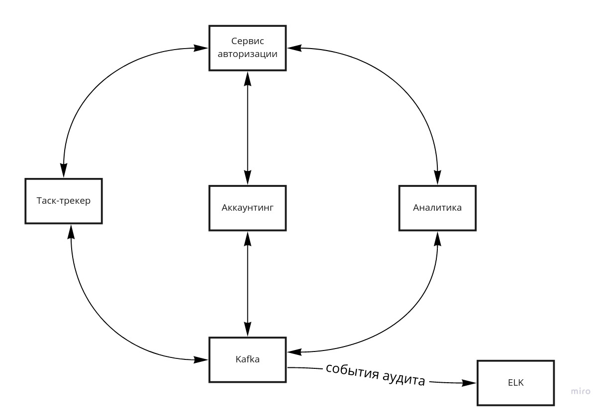
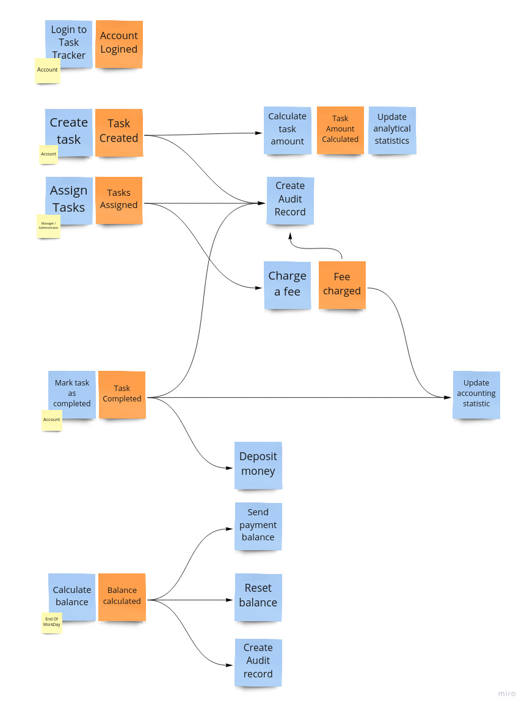
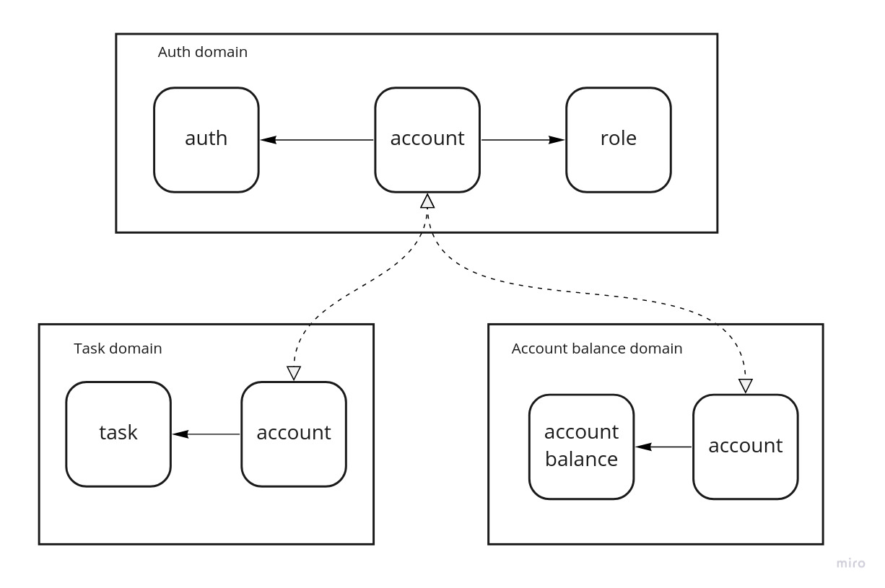
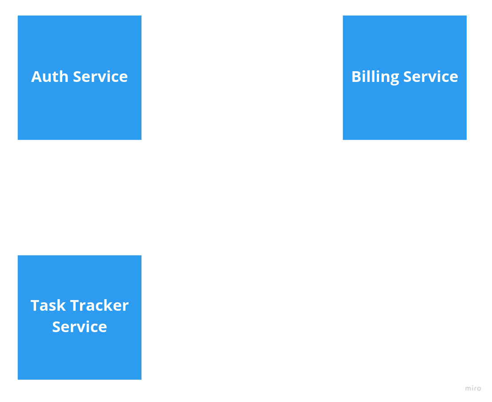
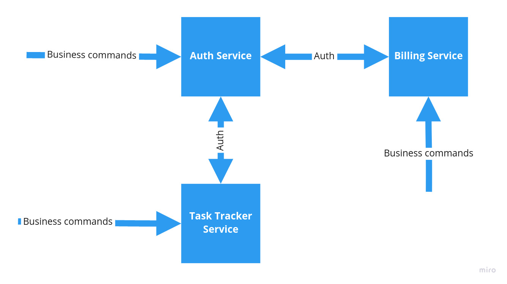
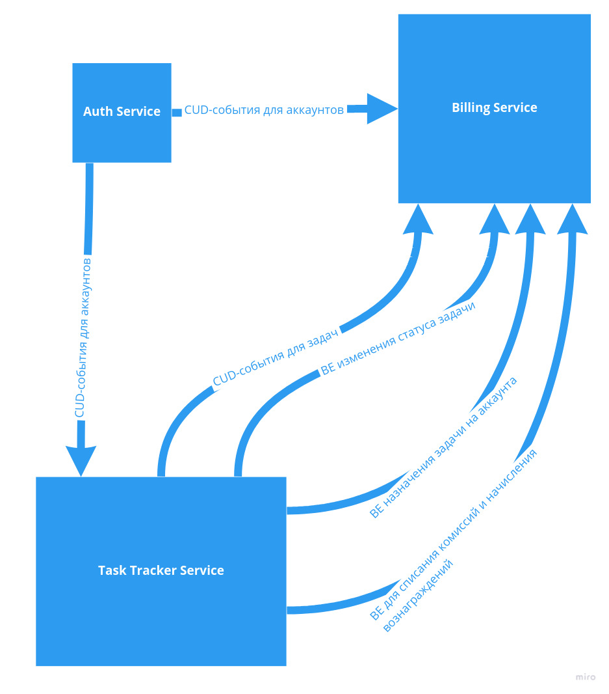

# aTES
Awesome Task Exchange System (aTES) для UberPopug Inc

# Первоначальное видение

# Разбор требований Таск-трекера

## Таск-трекер должен быть отдельным дашбордом и доступен всем сотрудникам компании UberPopug Inc.

Данные на чтение.

## Авторизация в таск-трекере должна выполняться через общий сервис авторизации UberPopug Inc (у нас там инновационная система авторизации на основе формы клюва).

- Actor — Account
- Command — Login to task tracker
- Data — ???
- Event — Account.Logined

## В таск-трекере должны быть только задачи. Проектов, скоупов и спринтов нет, потому что они не умещаются в голове попуга.

Упрощение предметной области.

## Новые таски может создавать кто угодно (администратор, начальник, разработчик, менеджер и любая другая роль). У задачи должны быть описание, статус (выполнена или нет) и попуг, на которого заассайнена задача.

- Actor — Account
- Command — Create task
- Data — Task (description, status, account public id, amount, fee)
- Event — Task.Created

## Менеджеры или администраторы должны иметь кнопку «заассайнить задачи», которая возьмёт все открытые задачи и рандомно заассайнит каждую на любого из сотрудников. Не успел закрыть задачу до реассайна — сорян, делай следующую.

1. Ассайнить задачу можно на кого угодно, это может быть любой аккаунт из системы.
2. Ассайнить задачу можно только кнопкой «заассайнить задачи»
3. При нажатии кнопки «заассайнить задачи» все текущие не закрытые задачи должны быть случайным образом перетасованы между каждым аккаунтом в системе
4. Мы не заморачиваемся на ограничение по нажатию на кнопку «заассайнить задачи». Её можно нажимать хоть каждую секунду.
5. На одного сотрудника может выпасть любое количество новых задач, может выпасть ноль, а может и 10.

Команда на назначение задачи:
- Actor — Manager/Administrator
- Command — Assign tasks
- Data — all open tasks
- Event — Task.Assigned

## Каждый сотрудник должен иметь возможность видеть в отдельном месте список заассайненных на него задач + отметить задачу выполненной.

- Actor — Account
- Command — Mark task as completed
- Data — account public id, task public id
- Event — Task.Completed

# Разбор требований аккаунтинга: кто сколько денег заработал
## Аккаунтинг должен быть в отдельном дашборде и доступным только для администраторов и бухгалтеров.
    1. **Updated:** у обычных попугов доступ к аккаунтингу тоже должен быть. Но только к информации о собственных счетах (аудит лог + текущий баланс). У админов и бухгалтеров должен быть доступ к общей статистике по деньгами заработанным (количество заработанных топ-менеджментом за сегодня денег + статистика по дням).

Данные на чтение.

## Авторизация в дешборде аккаунтинга должна выполняться через общий сервис аутентификации UberPopug Inc.

Авторизация аналогична требованиям к таск-трекеру.

## У каждого из сотрудников должен быть свой счёт, который показывает, сколько за сегодня он получил денег. У счёта должен быть аудитлог того, за что были списаны или начислены деньги, с подробным описанием каждой из задач.

События для аудитлога будут ниже.

## Расценки:
    - цены на задачу определяется единоразово, в момент появления в системе (можно с минимальной задержкой)
        - **Updated:** цены рассчитывается без привязки к сотруднику
    - **Updated:** формула, которая говорит сколько списать денег с сотрудника при ассайне задачи — `rand(-10..-20)$`
    - **Updated:** формула, которая говорит сколько начислить денег сотруднику для выполненой задачи — `rand(20..40)$`
    - деньги списываются сразу после ассайна на сотрудника, а начисляются после выполнения задачи.
    - отрицательный баланс переносится на следующий день. Единственный способ его погасить - закрыть достаточное количество задач в течении дня.

Команда на расчёт стоимости задачи:
- Actor — Task.Created
- Command — Calculate task amount
- Data — task public id
- Event — TaskAmount.Calculated

Команда списания комиссии при назначении на сотрудника:
- Actor — Task.Assigned
- Command — Charge a fee
- Data — account public id, task public id
- Event — Fee.charged

Команда пополнения счёта сотрудника при пометке задачи как выполненой:
- Actor — Task.Completed
- Command — Deposit money
- Data — account public id, amount
- Event — ???

Команда записи аудитлога после списания комиссии:
- Actor — Fee.charged
- Command — Create.AuditRecord
- Data — account, task
- Event — ???

Команда записи аудитлога после выполнения задачи:
- Actor — Task.Completed
- Command — Create.AuditRecord
- Data — account, task
- Event — ???

## Дешборд должен выводить количество заработанных топ-менеджментом за сегодня денег. **Updated:** удалилась строчка ~~Чтобы каждый попуг в компании знал, сколько заработал топ-менеджмент на сотрудниках~~.
    1. т.е. сумма всех закрытых и созданных задач за день с противоположным знаком: `(sum(completed task amount) + sum(created task fee)) * -1`

Операция чтения данных - будет вычисляться в рантайме при обращении.

## В конце дня необходимо:
    
    a. считать сколько денег сотрудник получил за рабочий день
    b. отправлять на почту сумму выплаты.

Команад пересчёта баланса в конце рабочего дня:
- Actor — Scheduler.EndOfWorkDay
- Command — Calculate balance
- Data — account public id, balance
- Event — Balance.Calculated

Команда отправки уведомлений о балансе на почту:
- Actor — Balance.Calculated
- Command — Send paymend balance
- Data — account public id, balance
- Event — ???

## После выплаты баланса (в конце дня) он должен обнуляться, и в аудитлоге всех операций аккаунтинга должно быть отображено, что была выплачена сумма.

Команда на обнуления счёта сотрудника:
- Actor — Balance.Calculated
- Command — Reset balance
- Data — account public id, balance
- Event — ???

Команда на запись в аудитлог:
- Actor — Balance.Calculated
- Command — Create audit record
- Data — account public id, balance
- Event — ???

## Дашборд должен выводить информацию по дням, а не за весь период сразу.
    1. вообще хватит только за сегодня (всё равно попуги дальше не помнят), но если чувствуете, что успеете сделать аналитику за каждый день недели — будет круто

Команда для обновления статистики при списывании комиссии:
- Actor — Fee.charged
- Command — Update accounting statistic
- Data — fee
- Event — ???

Команда для обновления статистики при начисления вознаграждения:
- Actor — Task.Completed
- Command — Update accounting statistic
- Data — amount
- Event — ???

**Подумать, возможно стоит, команды объединить.**

# Разбор требований Аналитики

## Аналитика — это отдельный дашборд, доступный только админам.

Чтение данных.

## Нужно указывать, сколько заработал топ-менеджмент за сегодня: сколько попугов ушло в минус.

Чтение данных

## Нужно показывать самую дорогую задачу за день, неделю или месяц.
    1. самой дорогой задачей является задача с наивысшей ценой из списка всех закрытых задач за определенный период времени
    2. пример того, как это может выглядеть:
        03.03 — самая дорогая задача — 28$
        02.03 — самая дорогая задача — 38$
        01.03 — самая дорогая задача — 23$
        01-03 марта — самая дорогая задача — 38$

- Actor — TaskAmount.Calculated
- Command — Update analytical statistics
- Data — task public id, amount
- Event — ???

# Технические дополнения
1. Никакого сложного UI-дизайна не надо, хватит самого банального бутстрапа или чистого html.
2. Никакого реалтайма тоже не нужно, хватит рефреша страницы для всех дашбордов и пользовательского интерфейса.
3. **Updated:** Вопрос нагрузки не стоит, можно считать, что максимальное количество пользователей будет не больше 100 пользователей в минуту.
4. Язык и технологии можно выбрать любые, кроме BrainFuck.
5. Все права на PopugJira принадлежат UberPopug Inc.
6. Желательно, чтобы ни один попуг в ходе выполнения ДЗ не пострадал.

# Модель данных

Модель данных с разбиением на домены представлена ниже:

Аккаунты - общее связующее звено между доменами.

# Разбиение на сервисы

Модель данных выше отображаются в следующие сервисы:

## Синхронные коммуникации

- процесс авторизации;
- бизнес-команды для сервиса аутентификации;
- бизнес-команды для сервиса биллинга;
- бизнес-команды для сервиса управления задачами

## Асинхронные коммуникации

- CUD-события для аккаунтов;
- CUD-события для задач;
- BE изменения статуса задачи;
- BE назначения задачи на аккаунта;
- BE для списания комиссий и начисления вознаграждений.

**Похоже нужно было всё же выделять отдельный сервис для аналитики. Но уже не хватает времени - чуть позже вынесу в отдельный сервис.**